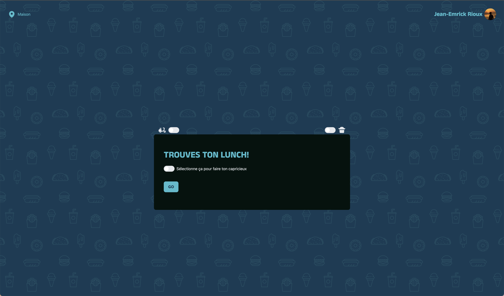
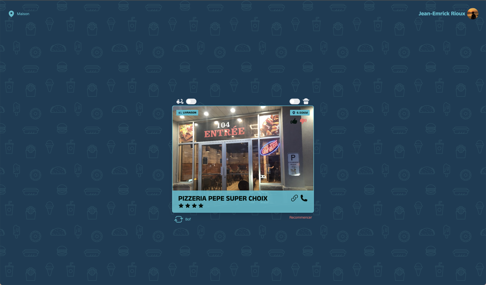

# [Mangequoi.com](https://mangequoi.com)

J'étais tanné de me faire demander ça par mon ami, faque j'ai codé un application qui intéragi avec l'API de Google Maps et le Geolocation API du browser pour suggérer un restaurant à proximité.

## Infrastructure
- [Railway](railway.app) pour la base de donnée SQL
- [Netlify](netlify.com) pour le déploiement 
- [Prisma ORM](prisma.com) pour la gestion de la base de donnée
- [NextAuth.js](next-auth.js.org) pour l'authentification
- [TRPC](trpc.io) pour la gestion des requêtes client-serveur
- [Next.js](nextjs.org) pour le rendu côté serveur
- [React](reactjs.org) pour le rendu côté client
- [TailwindCSS](tailwindcss.com) pour le CSS
- [HeadlessUI](headlessui.dev) pour les composants UI
- [Google Maps API](https://developers.google.com/maps/documentation/javascript/overview) pour les suggestions de restaurants
- [Geolocation API](https://developer.mozilla.org/en-US/docs/Web/API/Geolocation_API) pour la géolocalisation
- [Google Places API](https://developers.google.com/maps/documentation/places/web-service/overview) pour les détails des restaurants

## Comment ça marche
### 1. Tu arrives sur la page d'accueil

### 2. Tu donnes tes préférences s'il y a lieu

### 3. On te suggère un restaurant

